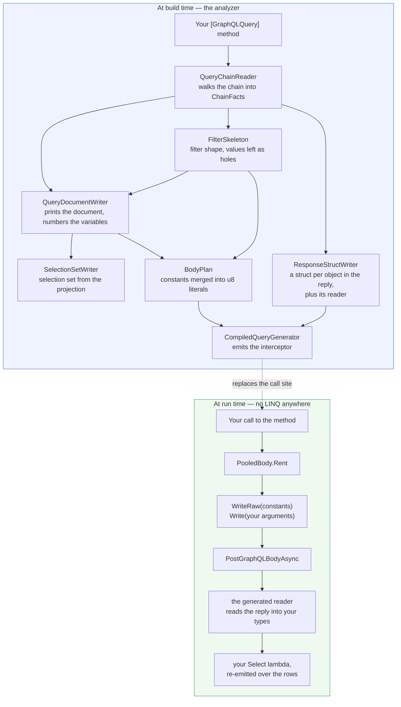

# Feather.GraphQL

A GraphQL client for .NET where the query is decided at build time.

A LINQ chain is not translated when it runs — it is read by an analyzer while you compile, printed
into a GraphQL document, and the call to it is replaced by the request it stands for. There is no
expression tree at run time, no reflection, and nothing for NativeAOT to be unable to see.

A chain the compiler cannot translate is a **build error**. That is the design, not a limitation
being worked around: a query either compiles or it is not this library's to send.

---

## 1. Writing a query

A query is a method. The chain is its body, and the attribute is what lets the compiler replace
every call to it.

```csharp
using Feather.GraphQL;
using Feather.GraphQL.Linq.Providers;
using Feather.GraphQL.Linq.Query;

// What the reply looks like. Ordinary classes — nothing to implement, nothing to register.
public class Country
{
    public string Name { get; set; } = "";
    public Continent Continent { get; set; } = new();
}

public class Continent
{
    public string Name { get; set; } = "";
}

// The server's filter input. Its shape is the schema's, not the element's — `continent` takes a
// string here, while the reply has an object.
public class CountryFilter
{
    public string? Continent { get; set; }
}

public static class Queries
{
    [GraphQLQuery]
    public static Task<Country[]> InContinentAsync(
        HttpClient client,
        string code,
        CancellationToken cancellationToken = default)
        => client.CreateQueryable<Country>("countries")
            .Where("filter", (CountryFilter f) => f.Continent == code)
            .Select(c => new Country
            {
                Name = c.Name,
                Continent = new Continent { Name = c.Continent.Name }
            })
            .ToArrayAsync(cancellationToken);
}
```

Calling it is an ordinary call:

```csharp
var countries = await Queries.InContinentAsync(client, "EU");
```

What goes on the wire is fixed when you build:

```json
{"query":"query($v0: String) { countries(filter: { continent: { eq: $v0 } }) { name continent { name } } }",
 "variables":{"v0":"EU"}}
```

The predicate is in the document, not hidden inside a variable — see
[§2](#why-the-filter-is-in-the-document) for why, and how to turn it off.

### Where the `HttpClient` comes from

A parameter, as above — or the type's own, which is what a service class usually looks like:

```csharp
public class CountryService(HttpClient client)
{
    [GraphQLQuery]
    public Task<Country[]> AllInAsync(string code)
        => client.CreateQueryable<Country>("countries")
            .Where("filter", (CountryFilter f) => f.Continent == code)
            .Select(c => new Country { Name = c.Name })
            .ToArrayAsync();
}
```

A field, a property, or a captured primary-constructor parameter all work, private included. A
method with no client anywhere is an error.

### Writing the document yourself

If you would rather write GraphQL than a chain, you never have to touch the LINQ side:

```csharp
using var response = await client.SendGraphQLQueryAsync("query { countries { name } }");
var data = await response.ReadGraphQLAsync<CountriesData>();
```

With variables, as any other client takes them:

```csharp
using var response = await client.SendGraphQLQueryAsync(
    "query($code: String!) { countries(filter: { continent: { eq: $code } }) { name } }",
    new Dictionary<string, object?> { ["code"] = "EU" });
```

Values are written by type rather than serialized: strings, the numeric types, `bool`, `Guid`, the
date and time types, enums (as their names), nested dictionaries, and sequences of any of those. A
type outside that list throws rather than falling back to reflection — which would work in
development and fail once published.

This path reads through `System.Text.Json`, so the type needs a source-generated
`JsonSerializerContext` in your own assembly. It is found and registered for you — but there is no
reflection fallback, so a type no context covers fails rather than quietly working.

---

## 2. How a query becomes a request

Everything above the dashed line happens while you compile. Nothing below it thinks about LINQ.



The method body never runs. Its chain exists so the compiler can read it and so the call
typechecks; the operators throw if they are ever reached, which happens only when a call was not
replaced.

What the generator emits for the query above, roughly:

```csharp
using var body = PooledBody.Rent(128);

body.WriteRaw("{\"query\":\"query($v0: String) { countries(filter: { continent: { eq: $v0 } }) "
            + "{ name continent { name } } }\",\"variables\":{\"v0\":"u8);
body.Write(code);
body.WriteRaw("}}"u8);
```

The document is never escaped at run time, because it was escaped once when you built.

### Why the filter is in the document

The predicate is written out where the server can read it, with a variable for each value it
compares against — not handed over whole as `filter: $v0`. Both ask for the same rows, but only
one of them says so in the document: a cost or complexity analyser runs over the query before any
variable is coerced, so an opaque input object is one it has to assume the worst of. Written out,
the shape is the query's and only the values are late.

The cost is that a variable in a document has to declare its type, and what the schema calls a
comparison's value is inferred from the CLR type against HotChocolate's defaults — `string` is
`String`, `Guid` is `UUID`, `int` is `Int`. A type that could reasonably be called several things
is not guessed: `char`, `TimeSpan`, `Uri` and the unsigned integers leave the whole filter in one
variable of the filter input type, which needs no such name. Where the inference is wrong for your
schema — a field it types as `ID`, say, against a `string` here — turn it off for that query:

```csharp
client.CreateQueryable<Country>("countries", o => o.InlineFilter = false)
```

---

## 3. Supported LINQ methods

The chain starts at `CreateQueryable<T>(rootField)` and ends at a terminal. Everything between is
from this table; anything else is an error.

### Shaping the request

| Method                           | Effect on the document                                           | Notes                                                                                                       |
| -------------------------------- | ---------------------------------------------------------------- | ----------------------------------------------------------------------------------------------------------- |
| `Where(p => …)`                  | `where: $vN`, a filter input built from the element's own fields | Conjunctions of comparisons on member paths.                                                                |
| `Where("arg", (TFilter f) => …)` | `arg: $vN`, a filter input of **your** shape                     | For when the schema's filter type is not the element's. The argument name is yours.                         |
| `OrderBy` / `OrderByDescending`  | `order: $vN` — `[{"field":"ASC"}]`                               | Keys and directions are known at build time, so the whole argument is a **constant**, not a variable value. |
| `ThenBy` / `ThenByDescending`    | appends to the same array                                        | Order of keys is the order you wrote them.                                                                  |
| `Select(c => …)`                 | **becomes the selection set**                                    | Only the fields you project are requested. The last `Select` wins.                                          |
| `Take(n)`                        | `take: $vN`, or `first: $vN` under cursor paging                 |                                                                                                             |
| `Skip(n)`                        | `skip: $vN`                                                      | Not available under cursor paging — there is no offset to skip to.                                          |

### Ending the chain

| Terminal                               | Document                                                      | Returns                              |
| -------------------------------------- | ------------------------------------------------------------- | ------------------------------------ |
| `ToArrayAsync()`                       | the selection as written                                      | `T[]`                                |
| `ToListAsync()`                        | the selection as written                                      | `List<T>`                            |
| `FirstAsync` / `FirstOrDefaultAsync`   | adds a page of **1**                                          | `T` / `T?`                           |
| `SingleAsync` / `SingleOrDefaultAsync` | adds a page of **2** — enough to prove there was not a second | `T` / `T?`                           |
| `LastAsync` / `LastOrDefaultAsync`     | `last: $vN`                                                   | `T` / `T?` — **cursor paging only**  |
| `AnyAsync`                             | asks for the cheapest scalar, page of 1                       | `bool`                               |
| `CountAsync` / `LongCountAsync`        | `totalCount` and **no rows at all**                           | `int` / `long` — needs a paged field |

`First`, `Single` and `Any` also take a predicate, which is merged into the filter.

### How paging changes the shape

Set it when you create the queryable — `o => o.Paging = PagingKind.Cursor`:

| `PagingKind`     | Rows arrive in   | `Take` binds | `Skip` | `Count` |
| ---------------- | ---------------- | ------------ | ------ | ------- |
| `None` (default) | the field itself | `take:`      | yes    | no      |
| `Cursor`         | `nodes { … }`    | `first:`     | no     | yes     |
| `Offset`         | `items { … }`    | `take:`      | yes    | yes     |

The generated reader is written for exactly one of these. It does not check which it got, because
the same compilation printed the document.

### Default argument names

`where`, `order`, `take`, `first`, `skip`, `last`. Change them per query with
`o => o.Arguments = new GraphQLArgumentNames { Filter = "filter" }`, or name one inline with the
`Where("arg", …)` overload.

---

## 4. Pitfalls

**A chain must be the body of a `[GraphQLQuery]` method.** Written anywhere else it has no call
site to replace — `FGQL017`. Composing a queryable into a local and filtering it later is not
supported; the whole chain has to be in one place, where the compiler can read it.

**The method must be called directly.** Interceptors replace call sites, so a method group, a
delegate or a reflective call reaches the real body — which throws. `FGQL018` catches this at
build time.

**A body may await the chain and go on.** `(await chain.ToArrayAsync(token)).Roster()` compiles:
what you write around the await runs client-side over the rows, so the replacement runs it there
too. One await, of the chain and nothing else around it — a body that wraps the chain without
awaiting it (`Task.FromResult(…)`) is `FGQL015`, because that wrapper is code the replacement
would drop rather than run. The document is still the chain's alone: code after the await reads
the rows as they arrived, so a nested field the chain never asked for is unset there as anywhere
else.

**There is no fallback.** A chain the compiler cannot translate used to run the slow way. It now
fails to build — `FGQL015`, naming the reason. The fix is to change the chain, or to send the
document yourself with `SendGraphQLQueryAsync` and a dictionary of variables.

**`Select` decides the selection set.** No `Select` means every scalar field of the element, which
is usually more than you want — `FGQL012` says so when a query has no `Where`, `Take` or `Select`
at all.

**Projections are re-emitted, not matched by name.** Your lambda runs over the rows verbatim, so a
rename or a computed value works. A nested object you pass through whole — `new Summary(c.Name,
c.Continent)` — is built as your declared type, not a mirror of it.

**A projection may end in your own code.** A nested `Select`, an extension method, anything that
runs client-side: the compiler traces the fields the call is handed rather than refusing the
query for a method it was never going to understand. `c.Continent.Countries.Select(n => n.Name)
.Joined()` asks for `continent { countries { name } }` and copies the call into the shaping, where
it runs over the rows that came back. A method handed the objects themselves gets their own
scalars filled in, since which of them it reads is not visible. What it may not be handed is the
row — `c.Describe()` on the element is `FGQL015`, because the row carries the element's fields
without being its type.

**A selected collection has to be a one-dimensional array.** The reply is read by generated code
that fills an array — `Permission[]`, not `List<Permission>` or `IReadOnlyList<Permission>` — and
there is no conversion written from one to the other. A member the query selects that is declared
as anything else is `FGQL015`, naming the member: `'Permissions' is declared as
'List<PermissionEdge>', and a selected collection has to be an array`. This is about members of the
queried type, not about the terminal — `ToListAsync` still hands you a `List<T>`.

**A refusal points at the part of the chain it is about.** `FGQL015` is reported against the
expression the compiler stopped at rather than against the method, so the squiggle lands under the
member, the call or the value that could not be translated, and the message names it. If a
projection is refused and it is not obvious why, the underlined expression is the answer.

**A nested object with no scalar fields cannot be selected on its own** — `FGQL014`. Say what to
take from it.

**Only `T[]` and `List<T>` come back as sequences.** There is no `IAsyncEnumerable` terminal;
streaming was removed rather than half-supported.

**`GroupBy`, `Join`, `SelectMany` and the rest of `IQueryable` are visible but not supported.**
They compile as far as the type system is concerned and then fail as `FGQL015`. The type keeps
`IQueryable<T>` for familiarity, and the diagnostics carry the weight instead.

**Declared queries are stricter than chains.** `[GraphQLQuery("query { … }")]` on a partial method
implements it from the document. Aliases, fragments, directives and multiple root fields are not
modelled — `FGQL016`.

**The string path needs a `JsonSerializerContext`.** There is no reflection fallback any more, by
design. Declare the type you read into; the context is registered for you.

**Publishing with NativeAOT:** the analyzer targets `netstandard2.0` and opts out of AOT
properties, so a global `PublishAot=true` does not reach it. If you set `TargetFrameworks`
(plural) in your own build, note that the native compilation step does not run on a
multi-targeting outer build.

---

## Packages

| Package                                     | What it is                                                                                            | References                  |
| ------------------------------------------- | ----------------------------------------------------------------------------------------------------- | --------------------------- |
| `Feather.GraphQL.Abstractions`              | The declaring attribute, `PagingKind`, and the abstract `GraphQLException`                            | —                           |
| `Feather.GraphQL.Serialization`             | A reply's shape and how to read it: the error model, the readers, `PooledBody`, the contract registry | Abstractions                |
| `Feather.GraphQL.Http`                      | `HttpClient` extensions for sending a document and reading a reply                                    | Abstractions, Serialization |
| `Feather.GraphQL.Linq`                      | The chain surface the compiler reads, and the analyzer that reads it. No translator, no executor      | Abstractions, Serialization, Http |
| `Feather.GraphQL.Linq.Providers.HttpClient` | `CreateQueryable` over `HttpClient`, plus DI                                                          | Linq, Http                  |

Install `Feather.GraphQL.Linq.Providers.HttpClient` and everything above it comes with it. There is
nothing to configure: the analyzer and the interceptor opt-in a compiled chain needs both ride in
the `Feather.GraphQL.Linq` package, the first under `analyzers/`, the second under
`buildTransitive/`.

**The analyzer is not a package and never ships.** It is built from
`src/Feather.GraphQL.Linq.Analyzers`, packed into `Feather.GraphQL.Linq` under
`analyzers/dotnet/cs`, loaded by the compiler and by nothing else.

`Feather.GraphQL.Linq` depends on `Http` for the generated half only — a compiled query posts and
reads through it, so whoever ships the generator has to declare it. Nothing in the assembly itself
calls `Http`, and `Http` takes no reference back. Generated code depends on `Serialization` and
`Http`; it depends on `Feather.GraphQL.Linq` for nothing at all at run time.

## NativeAOT

Verified, not asserted. `samples/Feather.GraphQL.AotSmoke` publishes to a self-contained native
binary with zero trim or AOT warnings and exercises all three surfaces:

```bash
dotnet publish samples/Feather.GraphQL.AotSmoke -c Release -r osx-arm64 /p:PublishAot=true
```

That one runs against the projects in `src/`, which is not the same as running against the
packages. `samples/Feather.GraphQL.PackageSmoke` publishes the same program with one
`PackageReference` and no properties of its own, against packages `dotnet pack` has just written:

```bash
dotnet pack -c Release -o nupkg -p:Version=0.0.1-local
dotnet publish samples/Feather.GraphQL.PackageSmoke -c Release -r osx-arm64 \
  /p:PublishAot=true /p:FeatherVersion=0.0.1-local
```

It is deliberately outside the solution and stops the repository's `Directory.Build.props` at its
own folder, because what that file hands every project here is exactly what a consumer has to get
from the package instead.

## Benchmarks

The same query — `{ countries { name continent { name } } }` — sent four ways over a canned
transport, so what is measured is the client and not a server or a network. Apple M5 Pro,
.NET 10.0.8 arm64, BenchmarkDotNet 0.15.8, 2026-09-13.

**1 row**

| Method                              | Mean         | Ratio    | Allocated   | Alloc ratio |
| ----------------------------------- | ------------ | -------- | ----------- | ----------- |
| Static — a document you wrote       | 506.0 ns     | 1.00     | 2.05 KB     | 1.00        |
| Static, with variables              | 534.9 ns     | 1.06     | 2.12 KB     | 1.03        |
| **`[GraphQLQuery("…")]` declared**  | **343.7 ns** | **0.68** | **1.53 KB** | **0.75**    |
| `[GraphQLQuery("…")]`, filtered     | 352.8 ns     | 0.70     | 1.53 KB     | 0.75        |
| **`[GraphQLQuery]` compiled chain** | **360.3 ns** | **0.71** | **1.60 KB** | **0.78**    |
| `[GraphQLQuery]` chain, filtered    | 374.6 ns     | 0.74     | 1.60 KB     | 0.78        |
| GraphQL.Client                      | 953.0 ns     | 1.88     | 4.39 KB     | 2.14        |

**25 rows**

| Method                              | Mean           | Ratio    | Allocated   | Alloc ratio |
| ----------------------------------- | -------------- | -------- | ----------- | ----------- |
| Static — a document you wrote       | 3,966.8 ns     | 1.00     | 7.30 KB     | 1.00        |
| Static, with variables              | 3,966.6 ns     | 1.00     | 7.34 KB     | 1.01        |
| **`[GraphQLQuery("…")]` declared**  | **2,685.5 ns** | **0.68** | **6.33 KB** | **0.87**    |
| `[GraphQLQuery("…")]`, filtered     | 2,662.7 ns     | 0.67     | 6.28 KB     | 0.86        |
| **`[GraphQLQuery]` compiled chain** | **2,630.7 ns** | **0.66** | **7.42 KB** | **1.02**    |
| `[GraphQLQuery]` chain, filtered    | 2,660.8 ns     | 0.67     | 7.45 KB     | 1.02        |
| GraphQL.Client                      | 4,539.8 ns     | 1.14     | 9.65 KB     | 1.32        |

A compiled query is **about a third faster than posting the same document by hand**, and roughly
**1.7× faster than GraphQL.Client**. Carrying a variable costs nothing measurable on either path.

### What the numbers are and are not

**The comparison is narrow on purpose.** The transport is canned, so no row pays for a socket, a
server or a network — which is most of a real request. What is left is the part this library is
responsible for: building a request and reading a reply. Treat the ratios as the shape of the
difference, not as a speedup anyone will see end to end.

**The difference is one thing, not many.** Both paths now build their body the same way, through
the same pooled buffer. What separates them is that a compiled query had its document escaped and
its selection set decided at build time, and the static rows do that per request. Allocation at 25
rows is nearly level for the chain rows because the reply dominates, and the reply is the same
bytes either way.

**Timing moves under about 8% on generated rows are noise.** Editing the generator changes the
generated file's contents, which moves code and shifts alignment; unchanged code measures stable
to ~1% in a session, and rows whose source was regenerated do not. Judge generator changes on the
`Allocated` column, which is deterministic.

Raw tables are archived under [`docs/benchmarks/`](docs/benchmarks/), and
[`EndOfDayReport-2026-09-12.md`](EndOfDayReport-2026-09-12.md) records how the measurement
apparatus itself was tested, including the mistakes.

## Design notes

- [Eliminating the variable contract](docs/design/eliminating-the-variable-contract.md)
- [One compiled LINQ path](docs/design/one-compiled-linq-path.md)

## Specification

* [GraphQL Specification](https://spec.graphql.org/June2018/)
* [GraphQL homepage](https://graphql.org/learn)
